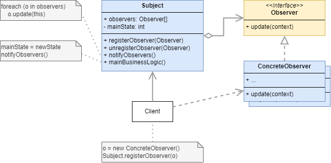
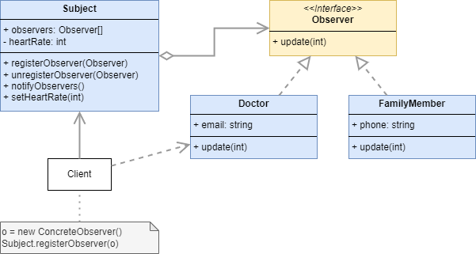

# Observer

## Definition

:fire: 

> [dofactory](https://www.dofactory.com/net/design-patterns): 
> The Observer design pattern defines a one-to-many dependency between objects so that when one object changes state, all its dependents are notified and updated automatically. 

> [Refactoring Guru](https://refactoring.guru/design-patterns/catalog):
> Observer is a behavioral design pattern that lets you define a subscription mechanism to notify multiple objects about any events that happen to the object they’re observing.

## UML

## Participants 

* `Subject`: Knows its observers. Any number of Observer objects may observe a subject. Provides an interface for attaching and detaching Observer objects.
  * example 1:
* `ConcreteSubject`: Stores state of interest to ConcreteObserver. Sends a notification to its observers when its state changes
  * example 1: `Subject`
* `Observer`: Defines an updating interface for objects that should be notified of changes in a subject.
  * example 1: `Observer`
* `ConcreteObserver`: Maintains a reference to a ConcreteSubject object. Stores state that should stay consistent with the subject's. Implements the Observer updating interface to keep its state consistent with the subject's.
  * example 1: `Doctor`, `FamilyMember`

## Examples

### Example 1: 

	

### Example 2:

<!-- TODO -->

## Pros and Cons
 
### Pros

:heavy_check_mark: Principio de abierto/cerrado. Puedes introducir nuevas clases suscriptoras sin tener que cambiar el código de la notificadora (y viceversa si hay una interfaz notificadora).

:heavy_check_mark: Puedes establecer relaciones entre objetos durante el tiempo de ejecución.

### Cons

:x: Los suscriptores son notificados en un orden aleatorio.
