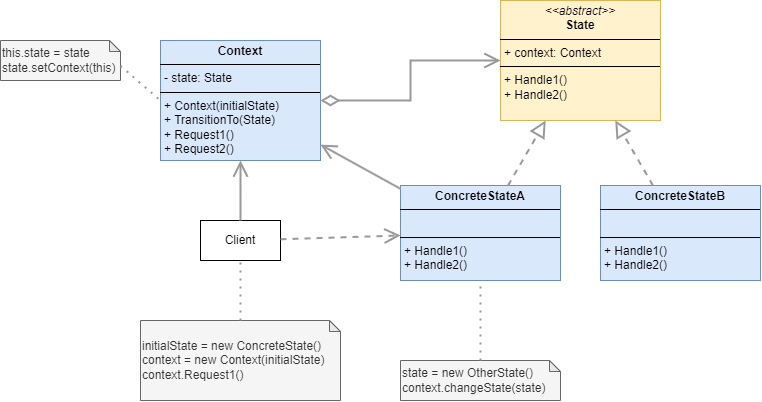
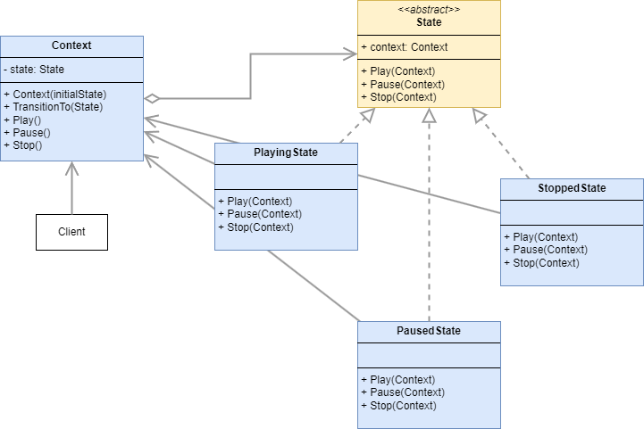

# State

## Definition

:fire: 

	

> [dofactory](https://www.dofactory.com/net/design-patterns): 
> The State design pattern allows an object to alter its behavior when its internal state changes. The object will appear to change its class.

> [Refactoring Guru](https://refactoring.guru/design-patterns/catalog):
> State is a behavioral design pattern that lets an object alter its behavior when its internal state changes. It appears as if the object changed its class.

## UML

	

## Participants 

* `Context`: Defines the interface of interest to clients. Maintains an instance of a ConcreteState subclass that defines the current state.
  * example 1: `VendingMachine`
* `State`: Defines an interface for encapsulating the behavior associated with a particular state of the Context.
  * example 1: `State`
* `ConcreteState`: Each subclass implements a behavior associated with a state of Context
  * example 1: `WaitingForSelectionState`, `DispensingState`, `WaitingForMoneyState`

## Examples

### Example 1: 

	

### Example 2:

<!-- TODO -->

## Pros and Cons
 
### Pros

:heavy_check_mark: Single Responsibility Principle. Organize the code related to particular states into separate classes.

:heavy_check_mark: Open/Closed Principle. Introduce new states without changing existing state classes or the context.

:heavy_check_mark: Simplify the code of the context by eliminating bulky state machine conditionals.
 

### Cons

:x: Applying the pattern can be overkill if a state machine has only a few states or rarely changes.
