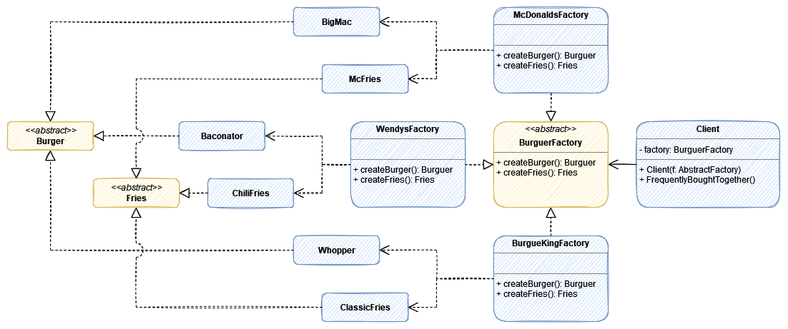

# Abstract Factory

> The Abstract Factory design pattern provides an interface for creating families of related or dependent objects without specifying their concrete classes. (dofactory)

> Abstract Factory is a creational design pattern that lets you produce families of related objects without specifying their concrete classes. (Refactoring Guru)

> An abstract factory is called a factory of factories. In this pattern, you provide a way to encapsulate a group of individual factories that have a common theme. In this process, you do not mention or specify their concrete classes. (Sarcar, 2018)

:boom: Create the same type of products (Not the same product!) but in different ways or Factories.  

## UML

or

## Participants

* AbstractFactory (`AnimalFactory`): 
	* declares an interface for operations that create abstract products
* ConcreteFactory (`AfricaFactory`, `AmericaFactory`):
	* implements the operations to create concrete product objects
* AbstractProduct (`Herbivore`, `Carnivore`): 
	* declares an interface for a type of product object
* Product (`Giraffe`, `Lion`, `Bison`, `Wolf`): 
	* defines a product object to be created by the corresponding concrete factory
	* implements the AbstractProduct interface
* Client (`AnimalWorld`):
	* uses interfaces declared by AbstractFactory and AbstractProduct classes

|							|AfricaFactory (ConcreteFactory)	|AmericaFactory (ConcreteFactory)	|
|---------------------------|-----------------------------------|-----------------------------------|
|Herbivore (AbstractProduct)|Giraffe (ConcreteProduct)			|Bison (ConcreteProduct)			|
|Carnivore (AbstractProduct)|Lion (ConcreteProduct)				|Wolf (ConcreteProduct)				|

## Pros and Cons

<!-- Pros -->

:heavy_check_mark: You can be sure that the products you’re getting from a factory are compatible with each other.

:heavy_check_mark: You avoid tight coupling between concrete products and client code.

:heavy_check_mark: **Single Responsibility Principle**. You can extract the product creation code into one place, making the code easier to support.

:heavy_check_mark: **Open/Closed Principle**. You can introduce new variants of products without breaking existing client code.

<!-- Cons -->

:x: The code may become more complicated than it should be, since a lot of new interfaces and classes are introduced along with the pattern.

## My Abstract Factory Example

