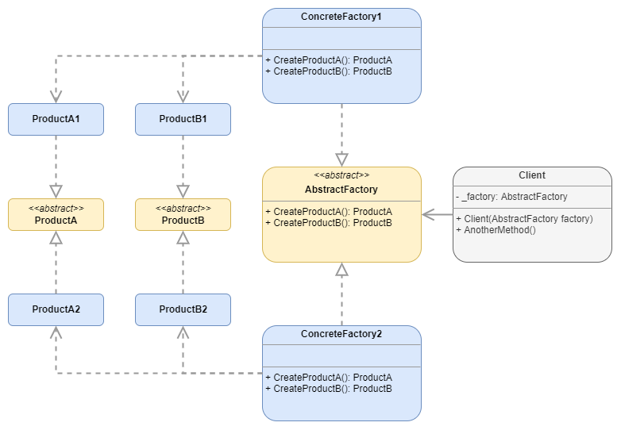
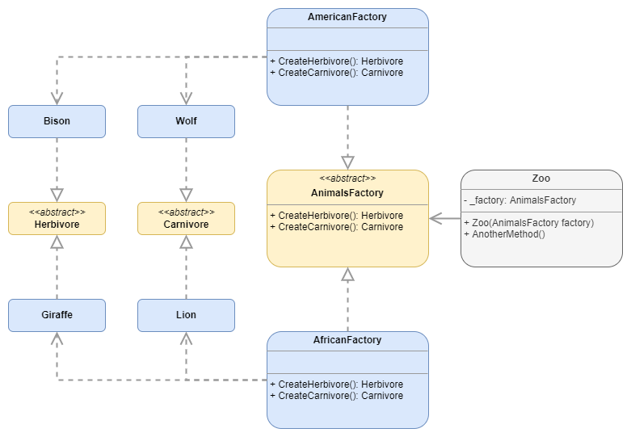
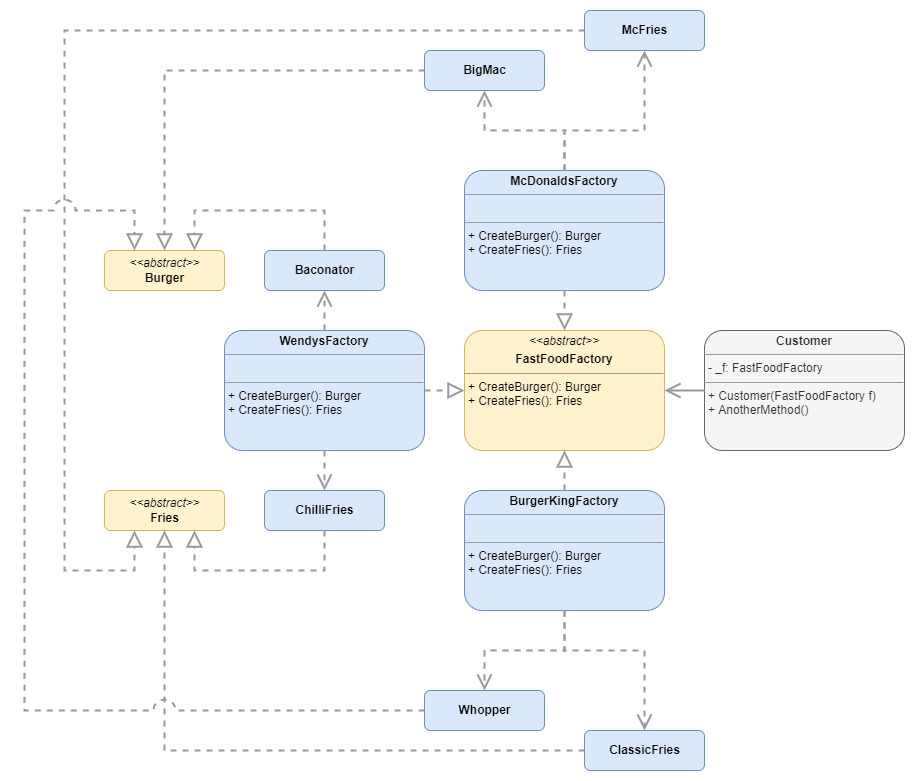

# Abstract Factory

## Definition

:fire: An abstract factory defines the abstract products that can be created, but the concrete factories implement the specific way in which the concrete products are created.
All concrete factories implement the abstract factory. All the concrete products implement the abstract products.

Image from Refactoring Guru.

> [dofactory](https://www.dofactory.com/net/design-patterns): 
> The Abstract Factory design pattern provides an interface for creating families of related or dependent objects without specifying their concrete classes. 

> [Refactoring Guru](https://refactoring.guru/design-patterns/catalog):
> Abstract Factory is a creational design pattern that lets you produce families of related objects without specifying their concrete classes.  

## UML

	

## Participants

* `AbstractFactory`: declares an interface for operations that create abstract products.
  * example 1: `AnimalsFactory`
  * example 2: `FastFoodFactory`
* `ConcreteFactory`: implements the operations to create concrete product objects
  * example 1: `AmericanFactory`, `AfricanFactory`
  * example 2: `McDonaldsFactory`, `WendysFactory`, `BurgerKingFactory`
* `AbstractProduct`: declares an interface for a type of product object
  * example 1: `Herbivore`, `Carnivore`
  * example 2: `Burger`,`Fries`
* (Concrete) `Product`: defines a product object to be created by the corresponding concrete factory. Implements the AbstractProduct interface.
  * example 1: `Giraffe`, `Lion`, `Bison`, `Wolf`
  * example 2: `BigMac`,`McFries`, `Baconator`,`ChilliFries`,`Whopper`,`ClassicFries`
* `Client`: uses interfaces declared by AbstractFactory and AbstractProduct classes
  * example 1: `Zoo`
  * example 2: `Customer`

## Examples

### Example 1: AnimalsFactory

	

### Example 2: FastFoodFactory

	

## Pros and Cons

### Pros

:heavy_check_mark: You can be sure that the products you’re getting from a factory are compatible with each other.

:heavy_check_mark: You avoid tight coupling between concrete products and client code.

:heavy_check_mark: **Single Responsibility Principle**. You can extract the product creation code into one place, making the code easier to support.

:heavy_check_mark: **Open/Closed Principle**. You can introduce new variants of products without breaking existing client code.

### Cons

:x: The code may become more complicated than it should be, since a lot of new interfaces and classes are introduced along with the pattern.