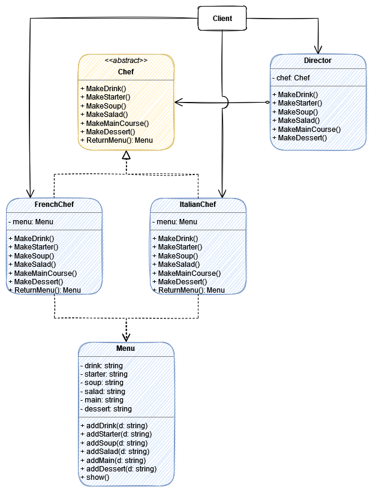

# Builder

> The Builder design pattern separates the construction of a complex object from its representation so that the same construction process can create different representations. (dofactory)

> Builder is a creational design pattern that lets you construct complex objects step by step. The pattern allows you to produce different types and representations of an object using the same construction code. (Refactoring Guru)

> Separate the construction of a complex object from its representation so that the same construction processes can create different representations. (Sarcar, 2018)

:boom: Assembly and Return (Build) the same Product but in different ways (or using different Parts).

## UML

## Participants

* Builder (`Builder`):
	* specifies an abstract interface for creating parts of a Product object
* ConcreteBuilder (`MotorCycleBuilder`, `CarBuilder`): 
	* constructs and assembles parts of the product by implementing the Builder interface
	* defines and keeps track of the representation it creates
	* provides an interface for retrieving the product
* Director (`Director`):
	* constructs an object using the Builder interface
* Product (`Vehicle`): 
	* represents the complex object under construction. ConcreteBuilder builds the product's internal representation and defines the process by which it's assembled
	* includes classes that define the constituent parts, including interfaces for assembling the parts into the final result

## Pros and Cons

<!-- Pros -->

:heavy_check_mark: You can construct objects step-by-step, defer construction steps or run steps recursively.

:heavy_check_mark: You can reuse the same construction code when building various representations of products.

:heavy_check_mark: Single Responsibility Principle. You can isolate complex construction code from the business logic of the product.

<!-- Cons -->

:x: The overall complexity of the code increases since the pattern requires creating multiple new classes.

## My Builder Example

