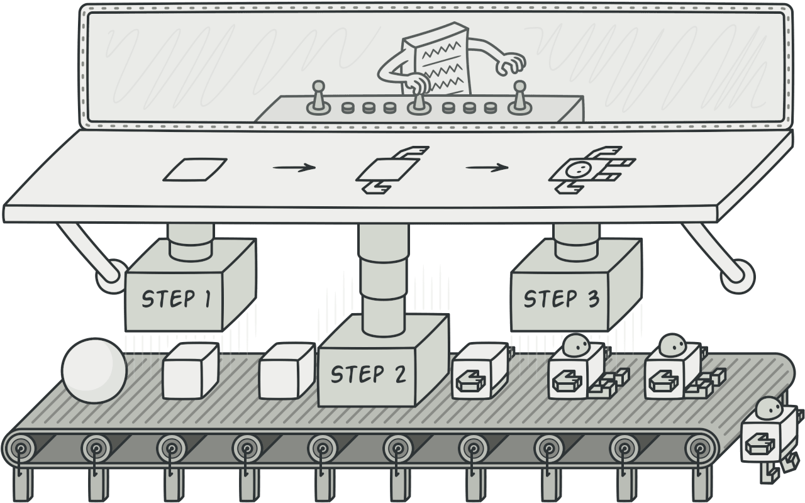

# Builder

## Definition

:fire: A Builder interface defines each of the components that can be created individually, so that every concrete Builder class that implements it define the specific way in which each component is created. The client can create the Product component by component or create predefined products defined inside a concrete Director class.

Image from Refactoring Guru.

> [dofactory](https://www.dofactory.com/net/design-patterns): 
> The Builder design pattern separates the construction of a complex object from its representation so that the same construction process can create different representations.

> [Refactoring Guru](https://refactoring.guru/design-patterns/catalog):
> Builder is a creational design pattern that lets you construct complex objects step by step. The pattern allows you to produce different types and representations of an object using the same construction code.

## UML

	

## Participants

* `IBuilder`: specifies an abstract interface for creating parts of a `Product` object
  * example 1: `IVehiclesBuilder`
  * example 2: `ISushiBuilder`
* `ConcreteBuilder`: constructs and assembles parts of the product by implementing the `IBuilder` interface. Defines and keeps track of the representation it creates. Provides an interface for retrieving the `Product`
  * example 1: `MotorcycleBuilder`, `CarBuilder`
  * example 2: `MakiBuilder`, `UramakiBuilder`
* `Director`: constructs an object using the `IBuilder` interface
  * example 1: `BMWDirector`, `SuzukiDirector`
  * example 2: `KyotoDirector`
* `Product`: represents the complex object under construction. `ConcreteBuilder` builds the product's internal representation and defines the process by which it's assembled. Includes classes that define the constituent parts, including interfaces for assembling the parts into the final result
  * example 1: `Vehicle`
  * example 2: `Sushi`

## Examples

### Example 1: Vehicle Builder

	

### Example 2: Sushi Builder

	

## Pros and Cons

### Pros

:heavy_check_mark: You can construct objects step-by-step, defer construction steps or run steps recursively.

:heavy_check_mark: You can reuse the same construction code when building various representations of products.

:heavy_check_mark: Single Responsibility Principle. You can isolate complex construction code from the business logic of the product.

### Cons

:x: The overall complexity of the code increases since the pattern requires creating multiple new classes.