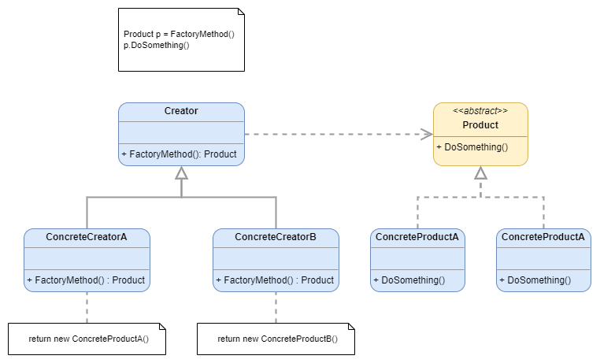

# Factory

:fire: Uses two interfaces: Constructor and Product, to define how every constructor create and define their products. Every constructor class can create objects without having to specify their exact class.

Image from Refactoring Guru.

> [dofactory](https://www.dofactory.com/net/design-patterns): 
> The Factory Method design pattern defines an interface for creating an object, but let subclasses decide which class to instantiate. This pattern lets a class defer instantiation to subclasses.

> [Refactoring Guru](https://refactoring.guru/design-patterns/catalog):
> Factory Method is a creational design pattern that provides an interface for creating objects in a superclass, but allows subclasses to alter the type of objects that will be created.

## UML

	

## Participants

* `Product`: defines the interface of objects the factory method creates
  * example 1: `Settlement`
  * example 2: `Bread`
* `ConcreteProduct`: implements the Product interface
  * example 1: `Hills`, `Desert`, `Forest`, `Mountains`, `Pasture`, `Fields`
  * example 2: `Bretzel`, `Croissant`
* `Creator`: declares the factory method, which returns an object of type Product. Creator may also define a default implementation of the factory method that returns a default ConcreteProduct object. May call the factory method to create a Product object.
  * example 1: `SettlementCreator`
  * example 2: `Bakery`
* ConcreteCreator: overrides the factory method to return an instance of a ConcreteProduct.
  * example 1: `HillsCreator`, `DesertsCreator`, `ForestsCreator`, `MountainsCreator`, `PasturesCreator`, `FieldsCreator`
  * example 2: `GermanBakery`, `FrenchBakery`

## Examples

### Example 1: Catan Settlements

	

### Example 2: Bakery

	

## Pros and Cons
 
### Pros

:heavy_check_mark: You avoid tight coupling between the creator and the concrete products.

:heavy_check_mark: **Single Responsibility Principle**. You can move the product creation code into one place in the program, making the code easier to support.

:heavy_check_mark: **Open/Closed Principle**. You can introduce new types of products into the program without breaking existing client code.

### Cons

:x: The code may become more complicated since you need to introduce a lot of new subclasses to implement the pattern. The best case scenario is when you’re introducing the pattern into an existing hierarchy of creator classes.