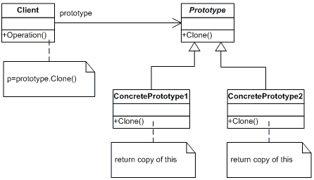

# Prototype

> The Prototype design pattern specifies the kind of objects to create using a prototypical instance, and create new objects by copying this prototype. (dofactory)

> Prototype is a creational design pattern that lets you copy existing objects without making your code dependent on their classes. (Refactoring Guru)

> Specify the kinds of objects to create using a prototypical instance, and create new objects by copying this prototype. (Sarcar, 2018)

:boom: Create copies of an object without interacting with the original class.

## UML

or

## Participants

* Prototype  (ColorPrototype)
    * declares an interface for cloning itself
* ConcretePrototype  (Color)
    * implements an operation for cloning itself
* Client  (ColorManager)
    * creates a new object by asking a prototype to clone itself

## Pros and Cons
 
<!-- Pros -->

:heavy_check_mark: You can clone objects without coupling to their concrete classes.

:heavy_check_mark: You can get rid of repeated initialization code in favor of cloning pre-built prototypes.

:heavy_check_mark: You can produce complex objects more conveniently.

:heavy_check_mark: You get an alternative to inheritance when dealing with configuration presets for complex objects.

<!-- cons -->

:x: Cloning complex objects that have circular references might be very tricky.