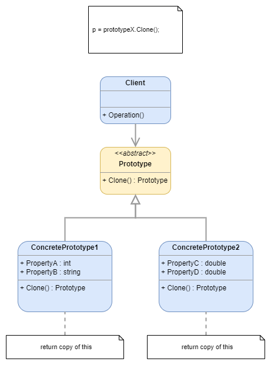
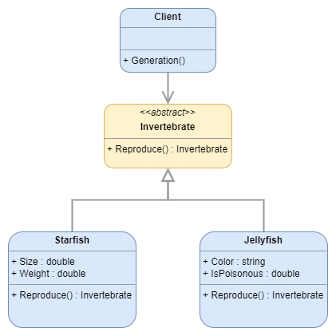
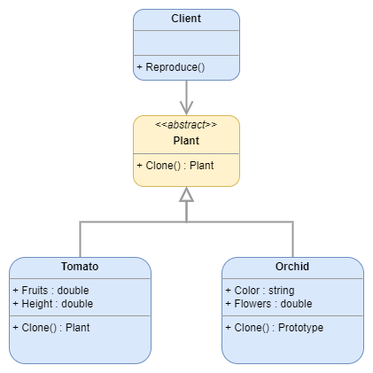

# Prototype

:fire: The classes implement a Clone method that allows an object to create an exact copy of itself.

> [dofactory](https://www.dofactory.com/net/design-patterns): 
> The Prototype design pattern specifies the kind of objects to create using a prototypical instance, and create new objects by copying this prototype.

> [Refactoring Guru](https://refactoring.guru/design-patterns/catalog):
> Prototype is a creational design pattern that lets you copy existing objects without making your code dependent on their classes.

## UML

	

## Participants

* `Prototype`: declares an interface for cloning itself
  * example 1: `Invertebrate`
  * example 2: `Plant`
* `ConcretePrototype`: implements an operation for cloning itself
  * example 1: `Starfish`, `Jellyfish`
  * example 2: `Tomato`, `Orchid`
* `Client`: creates a new object by asking a prototype to clone itself

## Examples

### Example 1: Invertebrate Animals

	

### Example 2: 

	

## Pros and Cons
 
### Pros

:heavy_check_mark: You can clone objects without coupling to their concrete classes.

:heavy_check_mark: You can get rid of repeated initialization code in favor of cloning pre-built prototypes.

:heavy_check_mark: You can produce complex objects more conveniently.

:heavy_check_mark: You get an alternative to inheritance when dealing with configuration presets for complex objects.

### Cons

:x: Cloning complex objects that have circular references might be very tricky.