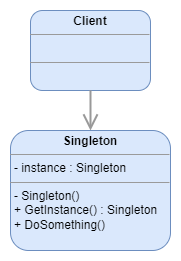
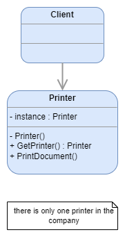
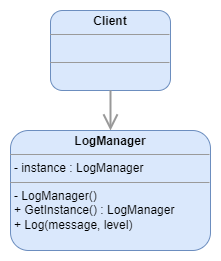

# Singleton

:fire: There is only one instance of a class, and it provide the same object to every client that needs it.

> [dofactory](https://www.dofactory.com/net/design-patterns): 
> The Singleton design pattern ensures a class has only one instance and provide a global point of access to it.

> [Refactoring Guru](https://refactoring.guru/design-patterns/catalog):
> Singleton is a creational design pattern that lets you ensure that a class has only one instance, while providing a global access point to this instance.

## UML

	

## Participants

* `Singleton`: defines an Instance operation that lets clients access its unique instance. Instance is a class operation. Responsible for creating and maintaining its own unique instance.
  * example 1: `Printer`
  * example 2: `LogManager`

## Examples

### Example 1: Printer

	

### Example 2: Log Manager

	

## Pros and Cons
 
### Pros

:heavy_check_mark: You can be sure that a class has only a single instance.

:heavy_check_mark: You gain a global access point to that instance.

:heavy_check_mark: The singleton object is initialized only when it’s requested for the first time.

### Cons

:x: Violates the Single Responsibility Principle. The pattern solves two problems at the time.

:x: The Singleton pattern can mask bad design, for instance, when the components of the program know too much about each other.

:x: The pattern requires special treatment in a multithreaded environment so that multiple threads won’t create a singleton object several times.
 
:x: It may be difficult to unit test the client code of the Singleton because many test frameworks rely on inheritance when producing mock objects. Since the constructor of the singleton class is private and overriding static methods is impossible in most languages, you will need to think of a creative way to mock the singleton. Or just don’t write the tests. Or don’t use the Singleton pattern.