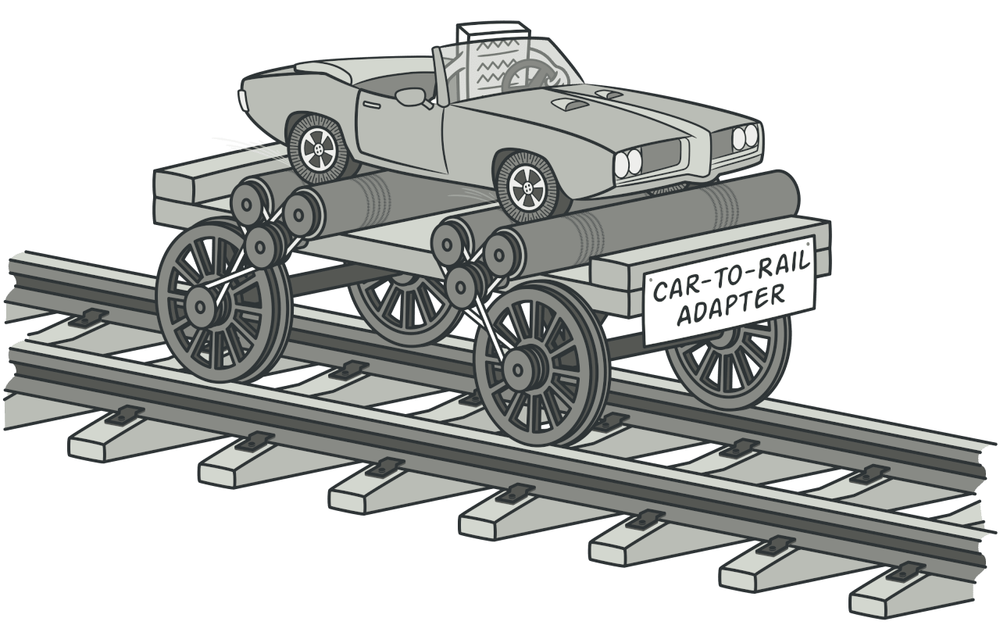

# Adapter

## Definition

:fire: 

> The Adapter design pattern converts the interface of a class into another interface clients expect. This design pattern lets classes work together that couldn‘t otherwise because of incompatible interfaces. (dofactory)

> Adapter is a structural design pattern that allows objects with incompatible interfaces to collaborate. (Refactoring Guru)

> Convert the interface of a class into another interface that clients expect. The Adapter pattern lets classes work together that could not otherwise because of incompatible interfaces. (Sarcar, 2018)

:boom: Helps client to work with a class the same way he is used to work with similar clases.

## UML

## Participants

* Target: defines the domain-specific interface that Client uses.
  * example 1: `Currency`
* `Adapter`: adapts the interface Adaptee to the Target interface.
  * example 1: `EuroAdapter`
* `Adaptee` or `Service`: defines an existing interface that needs adapting.
  * example 1: `Dollar`
* `Client`: collaborates with objects conforming to the Target interface.
  * example 1: `Program`

## Examples

### Example 1: 

	

### Example 2:

## Pros and Cons
 
### Pros

:heavy_check_mark: **Single Responsibility Principle**. You can separate the interface or data conversion code from the primary business logic of the program.

:heavy_check_mark: **Open/Closed Principle**. You can introduce new types of adapters into the program without breaking the existing client code, as long as they work with the adapters through the client interface.

### Cons

:x: The overall complexity of the code increases because you need to introduce a set of new interfaces and classes. Sometimes it’s simpler just to change the service class so that it matches the rest of your code.