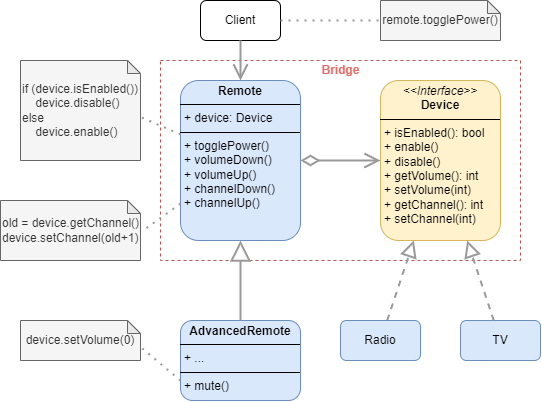

# Bridge

## Definition

:fire: Provides an interface with the same features or methods that apply to every concrete implementation object.

> [dofactory](https://www.dofactory.com/net/design-patterns): 
> The Bridge design pattern decouples an abstraction from its implementation so that the two can vary independently.

> [Refactoring Guru](https://refactoring.guru/design-patterns/catalog):
> Bridge is a structural design pattern that lets you split a large class or a set of closely related classes into two separate hierarchies—abstraction and implementation—which can be developed independently of each other.

## UML

## Participants

* `Abstraction`: defines the abstraction's interface Maintains a reference to an object of type Implementor.
  * example 1: `Remote`
* `RefinedAbstraction`: extends the interface defined by Abstraction.
  * example 1: `AdvancedRemote`
* `Implementation`: defines the interface for implementation classes. This interface doesn't have to correspond exactly to Abstraction's interface; in fact the two interfaces can be quite different. Typically the Implementation interface provides only primitive operations, and Abstraction defines higher-level operations based on these primitives.
  * example 1: `Device`
* `ConcreteImplementations`: implements the Implementor interface and defines its concrete implementation.
  * example 1: `Radio`, `TV`.

## Examples

### Example 1: 

	

### Example 2:

<!-- TODO -->

## Pros and Cons
 
### Pros

:heavy_check_mark: You can create platform-independent classes and apps.

:heavy_check_mark: The client code works with high-level abstractions. It isn’t exposed to the platform details.

:heavy_check_mark: Open/Closed Principle. You can introduce new abstractions and implementations independently from each other.

:heavy_check_mark: Single Responsibility Principle. You can focus on high-level logic in the abstraction and on platform details in the implementation.

### Cons

:x: You might make the code more complicated by applying the pattern to a highly cohesive class.